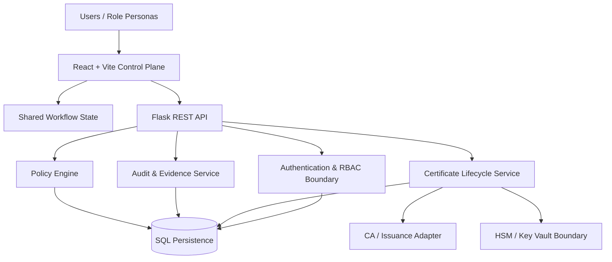
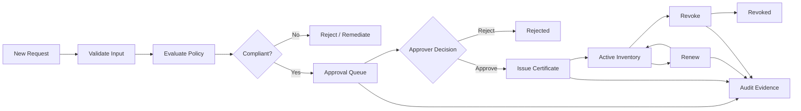

# PKI Certificate Lifecycle Automation Service

> Enterprise-style control plane for certificate lifecycle automation, PKI governance, policy enforcement, approvals, auditability and operational monitoring.


## Executive Overview

The **PKI Certificate Lifecycle Automation Service** is an enterprise-style security control plane designed to centralize certificate requests, policy validation, approval workflows, inventory, renewal, revocation, trust configuration, RBAC, audit evidence and service health.

The application is built as an operational system rather than a static dashboard. Lifecycle actions update shared application state so certificate inventory, approval queues, audit history, alerts and dashboard metrics remain synchronized.

> **Development status:** active. The project uses synthetic enterprise data and simulated CA/HSM boundaries. It is not a production Certificate Authority and does not store real private keys.

## Architecture



See the detailed [System Design](docs/SYSTEM-DESIGN.md) and [Architecture Guide](ARCHITECTURE.md).

## Certificate Lifecycle Flow



## Capability Map

| Domain | Capabilities |
|---|---|
| Certificate Management | Request, policy validation, approval, inventory, renewal, revocation |
| PKI Governance | Crypto policies, compliance rules, trust configuration |
| Secure Operations | HSM / Key Vault visibility and cryptographic boundary modelling |
| Audit & Monitoring | Searchable audit evidence, events, alerts, health telemetry |
| Identity & Access | Users, roles, permissions, separation-of-duties concepts |
| Control Plane | Shared state, routed workflows, synchronized dashboard metrics |

## Repository Layout

```text
.
├── .github/
│   ├── workflows/ci.yml
│   ├── ISSUE_TEMPLATE/
│   └── pull_request_template.md
├── backend/
│   ├── app.py
│   ├── requirements.txt
│   └── run.bat
├── frontend/
│   ├── src/
│   │   ├── data.js
│   │   ├── store.js
│   │   ├── main.jsx
│   │   └── style.css
│   ├── index.html
│   └── package.json
├── docs/
│   ├── API.md
│   ├── DATA-MODEL.md
│   ├── DEMO-WALKTHROUGH.md
│   ├── OPERATIONS.md
│   ├── PROJECT-GUIDE.md
│   ├── RUNBOOK.md
│   ├── SYSTEM-DESIGN.md
│   └── WORKFLOWS.md
├── ARCHITECTURE.md
├── SECURITY.md
├── CONTRIBUTING.md
├── .env.example
└── README.md
```

## Local Development

### Backend

```powershell
cd backend
py -3.12 -m venv .venv
.\.venv\Scripts\Activate.ps1
python -m pip install -r requirements.txt
python app.py
```

API: `http://127.0.0.1:8000`

### Frontend

```powershell
cd frontend
npm install
npm run dev
```

Open the Vite URL printed in the terminal.

## Data & Demonstration Scope

The seeded environment contains **560 synthetic certificates**, certificate requests, signing workflow records, users, roles, crypto policies, compliance rules, trust authorities, HSM/Key Vault health objects, alerts and hundreds of audit events. No real organizational or customer data is used.

## Security Boundary

The browser is not a trusted cryptographic boundary. A production implementation must enforce authorization and policy server-side, use authenticated identities and MFA, store private keys only in approved HSM/KMS services, protect audit evidence from tampering, and integrate with real CA revocation and issuance services.

See [SECURITY.md](SECURITY.md).

## Engineering Documentation

- [Architecture Guide](ARCHITECTURE.md)
- [System Design](docs/SYSTEM-DESIGN.md)
- [Workflow Catalogue](docs/WORKFLOWS.md)
- [Data Model](docs/DATA-MODEL.md)
- [API Guide](docs/API.md)
- [Operations & Reliability](docs/OPERATIONS.md)
- [Runbook](docs/RUNBOOK.md)
- [Demo Walkthrough](docs/DEMO-WALKTHROUGH.md)
- [Contribution Standard](CONTRIBUTING.md)

## Current Engineering Roadmap

The next hardening phase focuses on server-backed workflow persistence, authenticated identity, server-side authorization, CA connector abstractions, HSM/KMS adapters, structured migrations, automated workflow tests, observability and deployment hardening.

---

**Security engineering reference implementation — designed around PKI lifecycle governance, auditability and operational control.**
