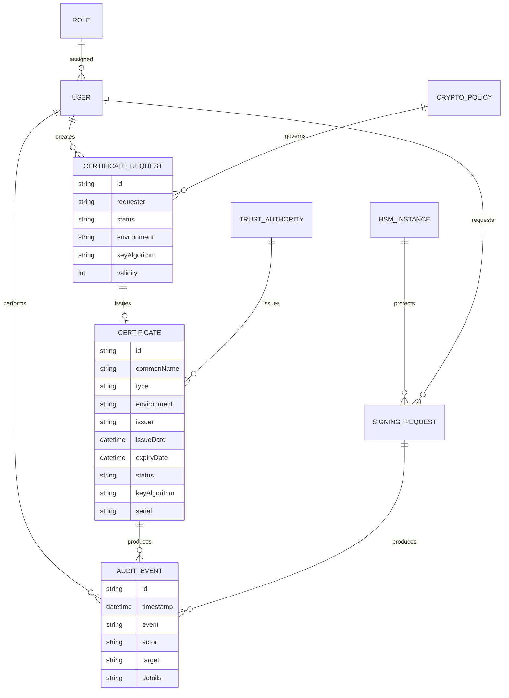

# Data Model

The frontend seed contains hundreds of synthetic certificate and audit records to exercise filtering, expiry, approval and monitoring workflows without using real organizational data.
