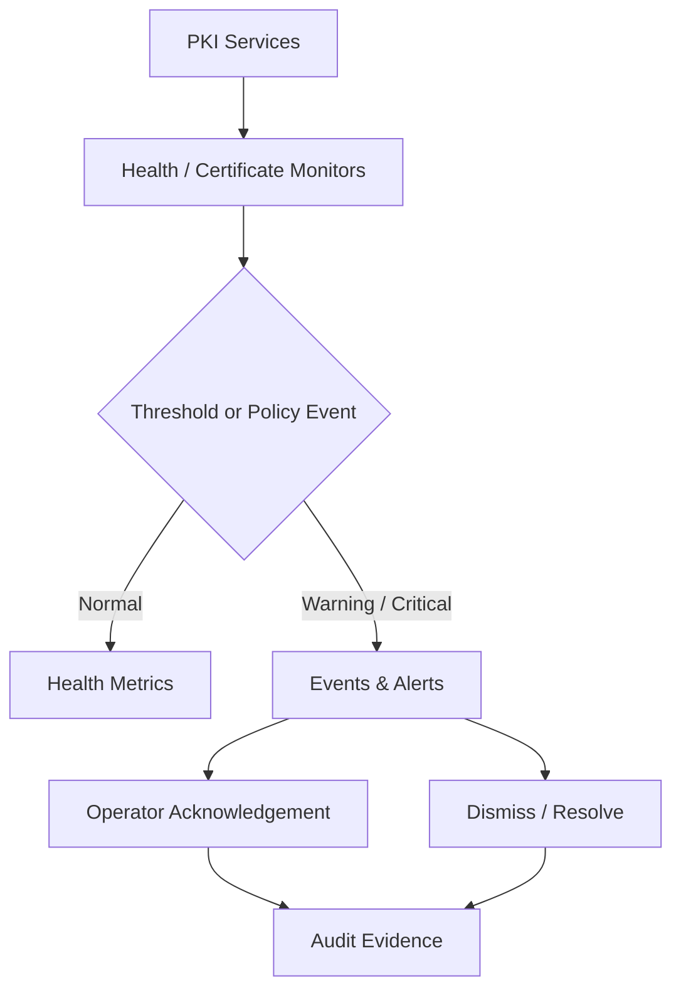

# Operations and Reliability

## Health model

The control plane models health for the API service, PKI database, HSM service, signing worker, audit pipeline and notification service. Operational views expose uptime, response time and last-incident information.

## Operational event flow

## Production hardening backlog

- Authenticated identity provider and MFA
- Server-side RBAC and separation-of-duties enforcement
- PostgreSQL or managed relational persistence
- Real CA connector with idempotent lifecycle operations
- HSM/KMS adapter with non-exportable private keys
- Tamper-resistant audit storage and SIEM export
- Metrics, tracing, structured logs and SLOs
- Backup/recovery, key ceremony and disaster-recovery procedures
