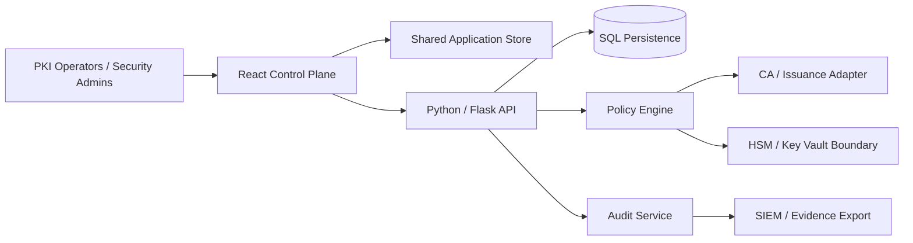

# System Design

## Context

The current implementation uses simulated CA/HSM integrations and synthetic enterprise data. Production cryptographic operations must remain behind server-side authorization and approved key-management boundaries.

## Control-plane responsibilities

| Layer | Responsibility |
|---|---|
| React UI | Routed workflows, inventory, approvals, monitoring and administration |
| Shared store | Consistent demo state and immediate cross-module updates |
| Flask API | Service boundary, health, approval and audit endpoints |
| SQL | Durable application records in the backend foundation |
| Policy | Algorithm, validity and environment control concepts |
| CA/HSM adapters | Future production integration boundary |
| Audit | Evidence for lifecycle and administrative actions |

## Trust boundary

The browser is never a trusted cryptographic boundary. Private keys must not be generated, exported or persisted in frontend state. Production signing and issuance should execute in server-side services backed by HSM/KMS controls.
