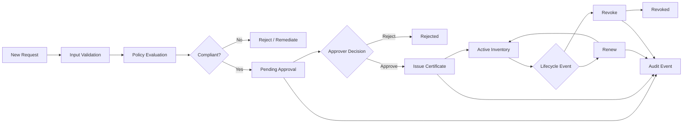
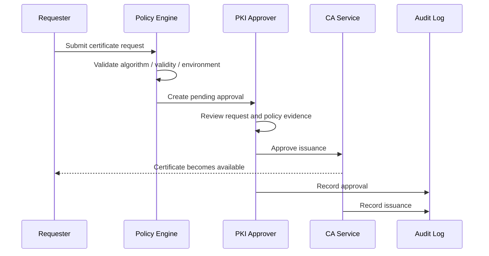

# PKI Workflow Catalogue

## Certificate lifecycle

## Approval and separation of duties

## Revocation

A revocation changes certificate lifecycle state, records the revocation timestamp and emits an audit event. A production implementation would additionally update CA revocation services such as CRL/OCSP.
